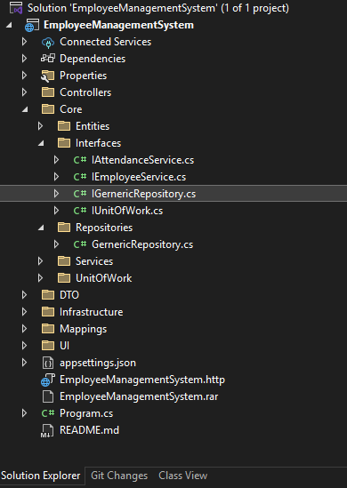
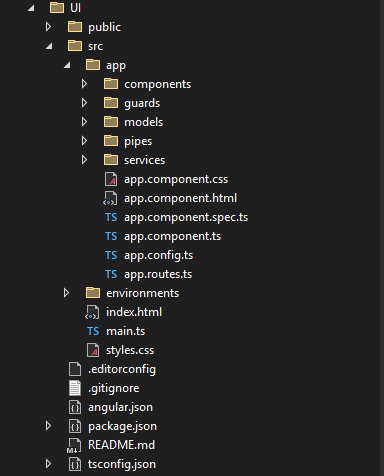
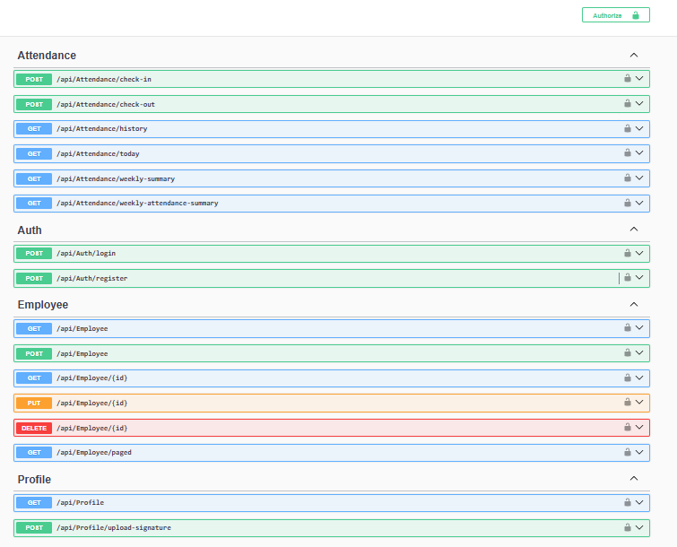
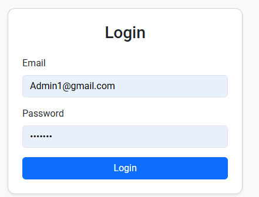
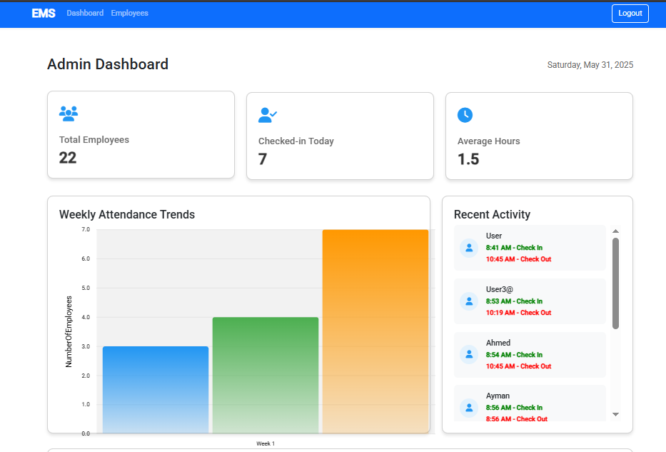
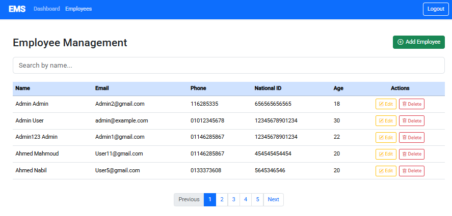
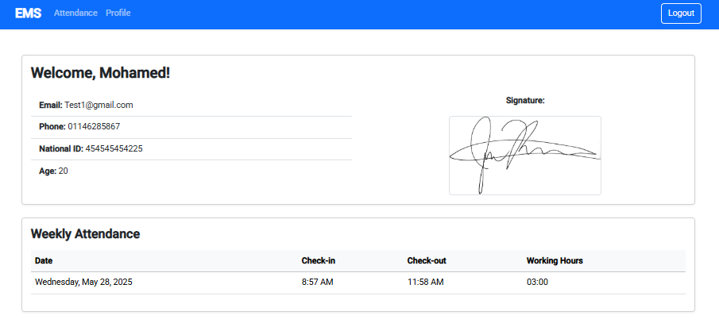
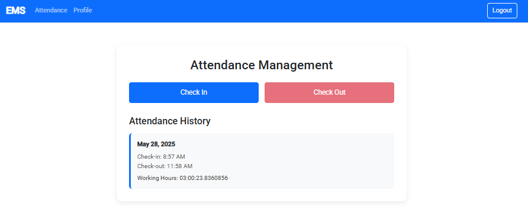

# Employee Management System

A modern, full-stack web application for managing employee data, attendance, and daily operations with role-based access control.


## 📋 Project Description

The Employee Management System is a comprehensive solution designed to streamline HR operations and employee management. It provides a secure, user-friendly interface for both administrators and employees to manage their daily tasks and information.

### Project Demo
🚀  Project Demo (https://youtu.be/AIalfqIH-3M)

### Key Features

### 🔐 Secure Authentication & Authorization
- JWT-based token authentication
- Role-based access control: **Admin** & **Employee**
- Passwords hashed securely with token lifecycle management

### 👥 Employee Management (Admin)
- Add, edit, and delete employee profiles with full CRUD operations
- Required fields: First Name, Last Name, Phone Number, National ID, Age, and optional Signature
- Interactive employee listing: pagination, sorting, filtering
- User feedback on operations (e.g., confirmations, error toasts)

### ⏰ Attendance Tracking
- Employees check in once daily between **7:30 AM - 9:00 AM**
- Prevents duplicate check-ins and gives informative messages
- Admin can view all daily attendance and **weekly work hours**
- Attendance history log with summaries and trends 

### ✍️ Digital Signature Support
- Signature can be uploaded or drawn during or after registration
- Used for verification and secure documentation
- 
### 👨‍💼 Employee Portal
- View and update personal profile
- Access weekly check-in history
- Upload signature if not set by admin
- Clean and responsive UI design
### 🎨 Modern UI/UX
  - Responsive design for all devices
  - Clean and intuitive interface
 

## 🛠️ Tech Stack

### Backend
- ASP.NET Core 9.0 Web API
- Entity Framework Core
- SQL Server
- JWT Authentication
- Swagger

### Frontend
- Angular 17
- TypeScript
- BootStrap
- CSS

### Development Tools
- Visual Studio 2022
- Visual Studio Code
- Git
- SQL Server Management Studio

## 🚀 Getting Started

### Prerequisites
- .NET 9.0 SDK
- Node.js (v18 or later)
- Angular CLI
- SQL Server
- Visual Studio 2022 or VS Code

### Backend Setup

1. Clone the repository
```bash
git https://github.com/EMahmoudNabil/Employee-Management-System
```

2. Navigate to the backend directory
```bash
cd EmployeeManagementSystem.API
```

3. Install dependencies
```bash
dotnet restore
```

4. Update the connection string in `appsettings.json`

5. Run database migrations
```bash
dotnet ef database update
```

6. Start the API
```bash
dotnet run
```

The API will be available at `https://localhost:7001`

### Frontend Setup

1. Navigate to the frontend directory
```bash
cd EmployeeManagementSystem.Web
```

2. Install dependencies
```bash
npm install
```

3. Start the development server
```bash
ng serve
```

The application will be available at `http://localhost:4200`

## 📊 Database Schema

### Users
- Id (PK)
- Username
- Email
- PasswordHash
- RoleId (FK)
- CreatedAt
- UpdatedAt

### Roles
- Id (PK)
- Name
- Description

### Employees
- Id (PK)
- UserId (FK)
- FirstName
- LastName
-	Phone Number 
-	National ID 
-	Age 
-	Signature  


### Attendance
- Id (PK)
- EmployeeId (FK)
- CheckInTime
- CheckOutTime
- NumberOfHour


## 👮‍♂️ Roles and Permissions

👨‍💼 Admin
- Manage employee data (CRUD)
- View attendance records
- Handle roles and permissions
- System settings management

👷 Employee
- Check-in once daily within allowed time and check out
- View personal profile and attendance history
- Upload or draw signature if needed

## 📸 Screenshots
### Architecture Backend


### Architecture FrontEnd 


### EndPoint 

### Login Page


### Dashboard


### Employee Management

###  Profile Employee Management

###  Check in and check out For Employee


## 👨‍💻 Author

**Mahmoud Nabil**
- LinkedIn: https://www.linkedin.com/in/emahmoudnabil/
- Email: e.mahmoudnabil@gmail.com
- GitHub: https://github.com/EMahmoudNabil


 
